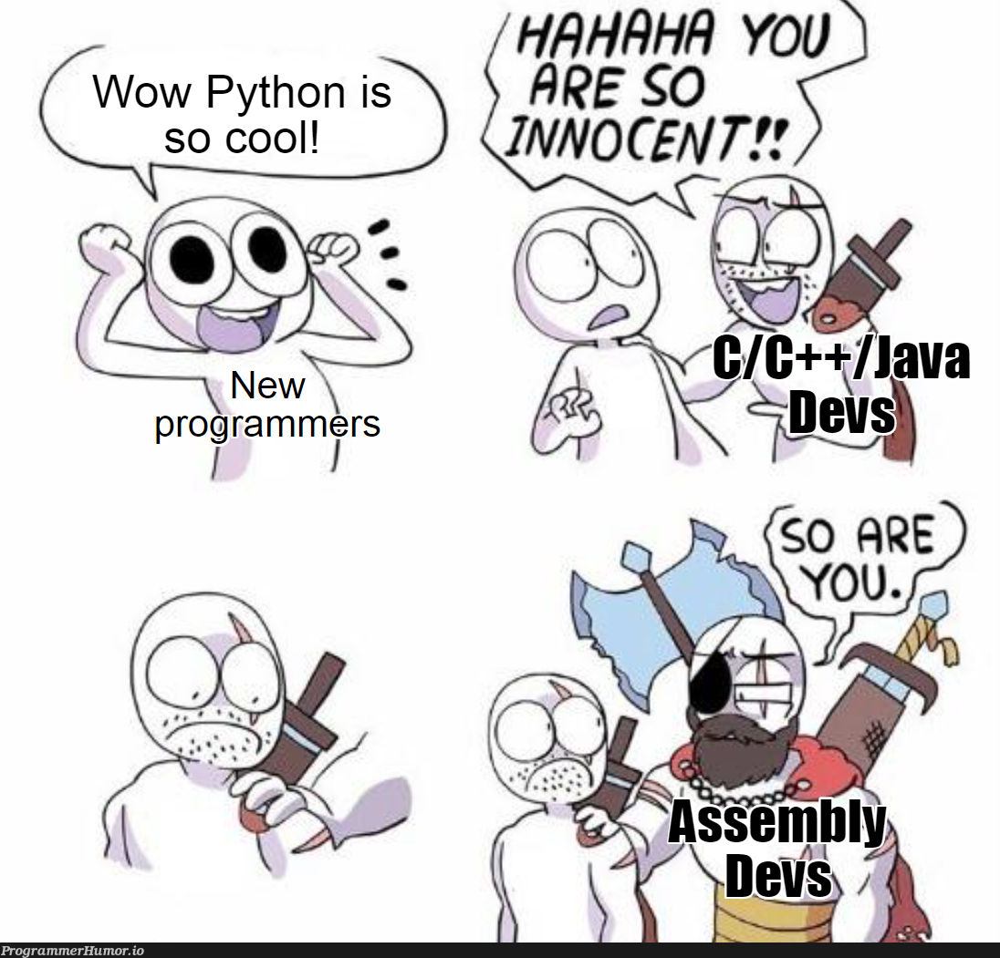
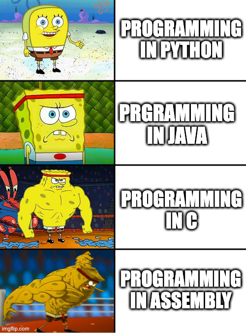

Sorry, I am not sorry about the orthographic pun.

Regardless, my inferior brainstem feels like babbling about a few videos by Casey Muratori on the excellent YouTube channel `Molly Rocket`, namely:

- [The Philosophy Of Optimization](https://www.youtube.com/watch?v=pgoetgxecw8), and I strongly encourage watching the full "Rfterm" episodes.
- [Where Does Bad Code Come From?](https://youtu.be/7YpFGkG-u1w?si=qVWfQ-WoOnT0sRmj)
- [Many Videos From The Software Quality Playlist](https://www.youtube.com/watch?v=Ge3aKEmZcqY&list=PLEMXAbCVnmY4JbNByvpgEzWsLRKVaF_pk)

While Casey has quite a few hot takes, we will speak only here about the "optimization" part and not some other topics like: "Code is running much slower nowadays than it should." Mainly because I'm not a developer, and my very limited experience with compiled languages makes my rotten brain unable to form a judgment here.

{fig-align="center" width="90%"}

The main conundrum is this: There is a finite upper limit for the optimization of a given piece of code, but there is no lower limit to how slow and crappy you can make it.

So bottom line, it is usually easier, faster, and more achievable to avoid putting garbage in the code rather than trying to optimize the shit out of it. Don't make things bad, m'kay?

Not convinced? I'll give you a clear practical example to other moronic data scientists like me that have never seen the inside of a compiler.
Look at BigQuery: this stuff is pure magic for processing Petabyte-scale datasets, with almost infinite scalability, and infinite parallelization.
Yet, with the right amount of criminal intellectual deviance, you can still make it as slow as a blind horse overdosing on Xanax that you shot in the leg to give it a good head start.

Now that I have your ameboid brain on board, let's go to the main topic:

## The Definition Of Non-Pessimization And Optimization

According to Casey, there are 3 different sides to what people call optimization:

1. Optimization:

   > Precisely **measuring, comparing, and testing** various properties of your code (speed, throughput, latency...), through various implementations if possible done on **hardware/context similar to its final execution**.

   Difficult, time-consuming, few people can do it, only useful for very key components of your system.

2. Non-Pessimization

   > Not introducing tons of crap work for the computer to do.

   Accessible to most people with moderate knowledge of a given paradigm/language, applicable almost everywhere, fast.

   I will personally add: it usually makes the code more readable to humans as well...

3. Fake Optimization

   > Trying to do No. 1 without measuring, rigorously testing, or skills.

   Typically happens when people are not able to do step 2 and jump directly to step 1.
   This usually makes things worse for everyone.

   Think people that try to strap multiprocessing/multiprocessing on your average code dumpster fire because "time will _SURELY_ be divided by 4 if I run my program on 4 cores"...

So we have to focus on things that are reasonable.

> - "But Dr. Rants, how can I possibly know when should I do No. 1, 2?"
> - "WRONG! No. 1 does not exist for you! For you, it's myth! Otherwise, you would not need to ask the question."
>   It's plain simple really. If you're trying to do Optimization on a code that bad because you just did not understand the concept of non-pessimization, then you're back to the whack-job No. 3!
>   For you only one thing matters:
>
>   NON-PESSIMIZATION!"

Then comes the **Real** question: How can I make my code not suck?

Casey has a pretty simple answer:

{fig-align="center" width="80%"}

## You Should Know A Bit Of Assembly

This is one of the probably hottest takes of Casey, i.e. his focus on having us learn a bit of assembly.
I will paraphrase but the general idea is:

1. You should learn assembly and be able to view your compiled program in assembly.
2. This way you will be able to actually see and understand HOW your program is doing what you instructed it to do.
3. The instruction set is limited and thus quite simple in comparison to other languages, especially high-level ones.
4. It makes a tremendous difference to be able to peek under the hood to develop an understanding of how the computer operates because you removed the middleman.
5. Even in high-level languages like JavaScript and Python, it is possible to have a look at the low-level code and it's not that difficult.

In short, it's not too difficult, useful, and you really understand how things run.

I have to admit that my lazy ass cheeks are happily clapping in the realm of high-level languages.
I am doing data science, where most of my days are spent within a DSL of Python: polars/pandas or in the happy declarative land of SQL.
And behold! Once in a while on a hot day, I do a few network calls, yeah real thug life!
Clearly, I am not the target audience when everything needs to be rewritten from scratch.

Only a madman would ask me to code a dictionary or an array manipulation framework from scratch!
Unless you really want your product to be a gaping security hell-hole, with nice entire chunks of memory leaks?
No? I thought so!
Anyway, if such a set of basic things are not part of the standard library or the package ecosystem, it is of little use/appeal to me.
This is why I am more interested in Rust/Go with their promise on performance while offering some higher-level interface with little overhead.

But enough digressions, in the vast lands of SQL and data warehouses, each with its own engine, translating your code to assembly makes no sense at all.
I am nevertheless genuinely curious to see if the large binary files for pandas/polars could be relatively "simple" as Casey tends to portray it.
And I would love to see the instruction sets and general layout there.

However, beyond the dark fearful "assembly" thingy, there is pure gold. Assembly here is just a means to obtain an understanding of how the computer operates and how your language of choice will choose to run certain operations.

This is where I am in complete agreement with Casey and where we can really witness:

## The Staggering Difference When People Have A General Idea Of How Their Code Runs

I have witnessed firsthand that in the DS world a huge discriminator for _not sniffing glue_, is simply having a vague mental model of how the code will run.
Let's take your favorite DS package: `pandas`.
Let's not delve into its broken API, and focus on the pure execution of things.
If I run a motherfucking `Cmd + Shift + F` to search on your whole code base, how many `.apply()` and `.iterrows()` will I find?
Don't lie to me and don't lie to yourself!
I'm not even talking about your horrible `inplace=True`, I am sure there are some guilty stains left.
Continue with this kind of stunts, and your next encounter with me will make an episode of Happy Tree Friends look like a casual garden party.

I see way too many people exhibiting a blatant dead-fish stare whenever you mention the word `vectorization` for operating on a dataframe, and blasting `.apply` calls to process text in every corner in the code because apparently typing `.str` is too complicated.

In SQL and your average distributed database, if you are treating a few GBs and it takes minutes, you, my friend, are the source of your own sorrow.
But at least, you have the excuse of being able to time your code properly.
This strengthens even more the need for non-pessimization, precisely because No. 1 optimization is even more difficult!

Besides, you don't want to be the person that writes SQL for 2 years before asking: "Wait a minute, does it change anything if my database is row- or column-oriented?"
You think I'm joking?
Most juniors I have seen, including myself, only get a brief exposure to SQL, land a job, and then you better pray to all the gods in creation that a randomly passing senior will explain to them what life is all about. Or else they will gut the data pipeline inside-out before turning into agents of Chaos!

Anyway, you can start by removing all the `ORDER BY` that basically rhyme with bottleneck, or your average `SELECT DISTINCT` which is only there to hide your shameful joins or a non-existent primary key, and while you're at it, learning about window functions won't kill you.

## You Make It Sound Easy

Well, at least not terribly difficult...
Still, it requires at least a few cardinal skills that are unattainable to the average LinkedIn shitposter compulsively liking all posts labeled: "17 core python functions you should know."
By that, I mean the capacity to perform a Google/LLM search with at least one brain cell engaged, the magic power of reading the documentation without experiencing an anxiety/boredom attack, and probably the most seldom of the three, a little shred of curiosity for what is the best way to use your current tool, framework, or DSL.

C'mon, let's talk real for a second!
When is the last time you added the words "best practices" to your search?
Instead, you started hacking code as if your product owner was trying to pin down JIRA tickets between your butt cheeks.
How many fucking hours do you spend each week in pandas/SQL?
Isn't it worth spending at least 5% of this time to learn how to better use the tool?
No need to answer, that's called a rhetorical question.

Learn a thing or two about your CPU, read something about the engine of your database, do a lot more than that if you use GPUs, and for the sake of everyone's sanity do a lot more than that if your model even remotely interacts with humans...
