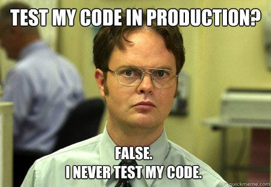

{fig-align="center" width="80%"}

## Big Brain Moment

> “To me, legacy code is simply code without tests.”
>
> _Michael C. Feathers, Working Effectively with Legacy Code_

> "With tests, we can change the behavior of our code quickly and verifiably. Without them, we really don't know if our code is getting better or worse.”
>
> _Michael C. Feathers, Working Effectively with Legacy Code_

Note: [Big Brain Reference](https://grugbrain.dev/)

## I Am A Simple Data Scientist, Are You Sure I Need Tests?

Which blog are you on? _**Data Science Rants!**_ Of course you need tests!

### Why Should I Test?

Because it would be nice to have a data science project working once in a while that isn't a complete dumpster fire.
Just for context, for developers nowadays the question isn't "should I automate my tests?", but rather "how, when, and on which infrastructure to mirror prod as closely as possible, and independently from other people working on different features?"
All senior developers advocate for regular and comprehensive testing strategies. The "State of DevOps" reports show testing as a major component of team performance and software reliability.

Sure, a lot of 'recent' advances in the developer and DevOps world have yet to make their entrée into the data world ([Data: The Land That DevOps Forgot](https://www.youtube.com/watch?v=459-H33is6o)).
One could say we're poorly equipped in terms of tooling, but one could also say we missed the fucking memo.
Some alleged data scientists will happily tell you they don't version their code without trembling...
Also, good luck convincing a junior DS to do anything outside their notebook without throwing a panic fit, or to fully automate their model selection/deployment via a simple CI/CD pipeline. You'll get an idea of what I mean.

Yet, data science folks are still curled up in a fetal, near-autistic position regarding developer best practices, meaning these concepts are usually totally absent from our average workflows.
In the end, why should we adopt something so different from our ways?

### Because Most Data Science Projects Never Reach Production

This means we're wasting time, money, and worse, efforts in dead projects when we could be doing more interesting and useful things for society.
But it's fine because we've always been told companies are the pinnacle of efficiency.

However, this bitter state of the data science profession is grounded in some harsh realities.
In addition to the absence of software engineering best practices, we're usually in a much worse situation than typical developers.
Indeed, we inherently have a particularly strong coupling to the data (shocker, right?).
Even small changes over time in data distribution tend to have a tremendous impact on machine learning systems, even though the data's structure itself stays the same.
And you know when that happens? _All the fucking time, for every damn use-case!_

Finally, we usually need to produce large amounts of code just to determine if a given model or analysis has even a chance of being remotely useful.
This creates a tension because the code seems constantly in a superposition of states: useless exploratory junk _AND_ awesome preprocessing for a big-gains model.
Then some very natural cognitive mechanisms kick in: "I don't need a test because I don't know if my code has any worth".
It's too late at this point because we'll see the tremendous forces that prevent us from writing tests after the code.

Facing these difficulties requires discipline, and one hell of a kind!
We need to import best practices from other IT disciplines that have demonstrated effectiveness in creating reliable software.

One of these practices is testing, so let's briefly recap some generalities.

### The Main Types of Tests

Unless you're living under a rock, you've probably heard of unit, integration, and acceptance testing. For a good definition, check out [Martin Fowler's Website](https://martinfowler.com/testing/). In the meantime, my pseudo-standard definitions are:

- **Unit tests:** Performed to validate the behavior of isolated functions and methods (more rarely classes and modules). Fast: < 1 ms. My personal grain of salt: No dependency on I/O or external systems (disk access, internet, database...), with absolute control of inputs and precise evaluation of outputs.

- **Integration tests:** Performed on a collection of functions, usually at the class and module level. Slower in general, but a few seconds max. I/O becomes possible, but my hot take is: you should only interact with local elements (mostly disk, local database replicas, components, or binaries from other sub-systems) and nothing that touches the internet.

- **Acceptance tests:** Performed on critical system paths to ensure key functionalities. Much slower, aiming for around a few minutes or even less. Otherwise, they're run less often and start losing value. Here, you can interact with other external systems over the network, databases, and such, but beware, beware!

These three types of tests constitute the cornerstone of a good, fully automated test suite that will allow you to determine with confidence if your system is working and behaving as expected.
Now, one question remains: when should you write your tests?

## Adopting A Testing Strategy

### No Tests At All

You, sir, are dangerous. You should be thrown in jail, and your ugly, dishonest, and deceiving notebook code should be lit on fire.
You're basically handing over a pile of garbage to your coworkers and yelling as you exit the building:

> "And good luck with any changes in business requirements, package version upgrades, refactoring, or general future evolutions, because you know it works on my machine... Oh, and by the way, the business wants this model in production next week..."

I despise you with every fiber of my being and will definitively high-five you at the first occasion... in the face... with a shovel!

### Writing Tests After Writing The Code

Either you probably have good intentions and don't know how to do it, but your heart is in a good place.
Or you've been told to write tests by a concerned tech lead because prod was on fire three times this week, and you reluctantly follow orders like a good soldier.
Regardless, there are a few problems with that approach:

1.  Assuming you're not a complete moron, you have at least run and tested your code manually, visually, or made sure it compiled.
    Strangely, the idea of writing a test already starts to lose meaning because you just saw it with your own eyes: the code is running.
    This mental block is, to me, and by far, the largest factor that prevents juniors from realizing the value of automated tests.

    ::: {.callout-important}
    Really, that's the main danger. The code runs, you just saw it.
    Then the brain automatically disconnects, and the lingering thought comes up: "Do I really need a test?"
    This is where it all ends.
    :::

1.  In addition, writing the test afterwards will be extremely painful and difficult because your code has not been written with testability as a core requirement.
    Then you'll need some decent luck and great efforts to isolate deterministic behavior in 100 lines of spaghetti with mutations everywhere and no clear responsibilities.

1.  As a direct consequence, tests also tend to become coupled with implementation details, making them brittle or flaky, and generally more difficult to maintain.
    The typical example is when you want to change one line in your production code; you clearly see the change, but then you also have to change 20 tests...
    This is usually a sign of bad coupling between tests and implementation.

1.  Some large chunks of the system will very likely escape any form of testing (a consequence of `reason #2.`) because of the impossibility to control their inputs and outputs.

Regardless, writing tests after will probably be a lot of pain, especially if a higher-up dropped a decaying legacy project on your lap.
In which case, you should turn to experts who will tell you how to effectively [test and manage the complexity of legacy codebases (remember: code without tests)](https://youtu.be/P_6eDL1aqtA?si=DieijfL9LdZeWTlj).

### Writing Tests And Code At The Same Time

Now we're finally getting somewhere.
Most of the issues mentioned in the previous section start to erode, with the main exception of `reason #3`.
The main risk with writing tests concurrently with code is increasing the coupling between the test and the code beyond what is strictly required.
This reduces maintainability and limits future changes and evolution.

However, there are cases where this approach can be fruitful, especially for certain scopes and contexts (more on that later).

### Writing Tests Before Any Code

At last, for any sleeping data scientist who managed to open an eyelid, this is the bread and butter of any self-respecting developer these days.
This is called Test-Driven Development, a.k.a. **TDD**, and this is [how to do it properly](https://www.youtube.com/watch?v=B1j6k2j2eJg):

1.  **RED:** You write a **failing** test, which, from well-defined inputs, asserts that a given piece of code has certain well-defined outputs.
    This is akin to writing specifications in the code.
2.  **GREEN:** You write the smallest, most simplistic, even idiotic code you can think of to make the test pass. Nothing more!
3.  **REFACTOR:** You replace the idiotic part you just wrote with something less stupid or ugly.
    **But pay attention!** You should not write anything that is not inside the test.
    The point is to let the tests and specifications drive the code.

And you repeat the cycle!

### The Advantages Of TDD

This (apparently contrived) way of testing has dramatic advantages:

- It completely breaks the idea of: "I don't need a test because I just saw my code run" because the code doesn't even exist yet.
- You are writing specifications for the observable behavior in the tests, not implementation details, meaning tests and code are less coupled.
- It forces you to write code in very small, incremental steps, and all the great old wizards of software engineering are pretty much saying this is the best way to work, period!
- You are usually able to fall back to working code with a bunch of automated tests within a few seconds. This is such a change that Kent Beck, the guy who coined the term TDD, called it Xanax for developers!
- The code becomes easier to test because you're writing with a clear goal to make it testable; otherwise, you're just making your life difficult. Duh!
- The incremental nature forces a progressive decoupling between the code and the test, which is a great sign for maintainability and increases the possibility of future changes.
- Because you want things to be easy to test, you naturally limit the scope of what your functions/classes can do, which increases their internal cohesion. They tend to do fewer things but do them better.

Overall, writing tests first has such a strong impact on your design.
Namely, it prevents you from doing stupid shit, like becoming your worst enemy and face-planting your project 3 meters underground.
You will actually keep the possibility to continue making changes to your code (see the **excellent YouTube channel** [Modern Software Engineering](https://www.youtube.com/@ModernSoftwareEngineeringYT/videos)).
Ain't that good enough in itself?

> - "But Sir Rants, if TDD is that good, why are data scientists not doing it?"
> - "Young lad, thank you for the very interesting question, allow me to introduce you to: ..."

## The Top 7 Obstacles That Prevent You From Testing

Dear reader, I apologize for the sudden surge of click-bait writing style, but this will likely be a long post, anyhow...
Actually, I am not sorry at all.
I am simply taking into account your Ritalin-infused brain equipped with the attention span of a cocaine-high chihuahua.

Writing tests is difficult, even for seasoned developers.
However, writing tests first with TDD is actually easier but also requires a strong shift of mindset.
In this bit, we're going to focus mostly on unit tests.
Reminder: the features of good unit tests are: _fast, deterministic, reproducible, decoupled from implementation details_.

1.  Most people advocating for the practice of TDD will repeat that it's an acquired skill, one that you need to train regularly.
    It will take you time and practice to master it.
    You can obviously set yourself up for failure by jumping directly into an old legacy project when you've never written an automated test.
    That sounds like a totally reasonable thing to do.

    ::: {.callout-tip}

    ### Solution

    Start practicing regularly with simple code katas.
    Do not attempt to test legacy codebases or data science workflows yet.
    It will very likely take you at least 3-4 months to get comfortable with the basics of testing.

    If possible, use a small side project at work where your hands are free to move, safe from the nasty hands of a greedy product manager.
    :::

1.  Please be sure to wait until you discover some catastrophic production failure before incorporating any kind of testing strategy.
    You want to lose financial transactions or have a very strong bias in your model exposed to your users? That will motivate you.
    Imagine after 6 months of crunching and regurgitating code, saying to your Product Manager that suddenly you want to write tests because one day you woke up and decided you cared about quality (hopefully after reading this rant).

    Now imagine that at the start of your project, you said to that blissfully unaware PM: "There shall be a test for every bit of code produced, and no test means no code, means no feature!"
    The only possible answer for that PM will be: "Amen."

    ::: {.callout-tip}

    ### Solution

    Start adopting a testing strategy as soon as possible in the project's lifetime, and hold onto it like your grandma holds onto the steering wheel while plowing through a crowd.
    In the extremely likely case of a legacy project, you must be aware that some bits will be impossible to test.
    This is where having practiced in isolation first (step 1.) will save you on more than a couple of occasions:

    - Find the separations inside the codebase where testing is possible in isolation; move it apart from the rest of the junk.
    - Test the newly produced code.

    :::

1.  The things you'll try to test at first will probably be too large, and the scope poorly defined.
    You can try to test the thing that has 10 input parameters and 3 different possible output types.
    Sure, you can try...

    ::: {.callout-tip}

    ### Solution

    Try to really limit the size and scope of functionalities you try to test at a given time.
    Take a smaller-sized approach.
    When you think this is small enough, make it even smaller!
    :::

1.  One very common error is to try to test the main functionality of a future piece of code right from the get-go. Rookie mistake!
    This is like head-butting a piece of concrete to make a wall fall down; it might work, but you might not be able to repeat that feat once your skull is cracked open.

    ::: {.callout-tip}

    ### Solution

    Do not jump directly to the core of the functionalities; start with the simple things and let the behavior progressively emerge from the iterative process.
    Let's take an idiotic example: imagine you want to sort elements of a list.
    Rather than giving a list of 10 numbers and making sure they are sorted in the end, start by passing an empty list (Great! We just found an edge-case!), then perhaps a list with one element (shocker, input and output should be the same...).
    :::

1.  Please make sure to make your tests as slow, flaky, and brittle as possible by systematically reading from the disk or, worse, the network or the database.
    This way, you'll be sure the tests are never run because they take 3 hours to complete, and you never know why they fail.

    ::: {.callout-tip}

    ### Solution

    Stay away from any kind of I/O, i.e., disk reads or writes, network calls, database calls, cloud interaction.
    You should refrain from committing such ungodly horrors.
    They do not belong in your unit-testing strategy, and even in integration testing, use them only if they **REALLY CANNOT BE AVOIDED**.
    :::

1.  Not knowing your testing framework is a pretty good way to butcher and obscure your test suite.
    Similarly, you can abuse mocking and stubbing your classes and functions to ensure that nobody, not even you in two weeks, understands whatever the test is doing.
    Continue in that direction, and you will even create tests that assert nothing at all!

    ::: {.callout-tip}

    ### Solution

    Take the time to understand how your testing framework is designed; what it allows you to reuse and what you should rewrite.
    Limit the mocking to the strict minimum to avoid dependencies on external services, but beware of their dark side.
    :::

1.  Not properly setting up your local environment and not learning to use your IDE/text editor is a very good way to set yourself up for failure.
    I saw you clearly wallowing in self-inflicted pain because you renamed manually each of the 10 occurrences of your variable when I forced you to get rid of the thing you so proudly named "temp".
    Your hesitation was palpable when I spoke about extracting a method, and you reached for the copy/paste like a headless chicken.
    How can you hope to write tests if you can't even navigate your codebase and perform the most basic actions to change it?

    ::: {.callout-tip}

    ### Solution

    Although it may appear secondary, you absolutely need to properly configure and be comfortable with your local environment.
    Otherwise, it will become a mental blocker and a hidden obstacle to your workflow.
    Install test extensions or plugins for your language inside your editor.
    You need first-class support to be able to run a single test, or all of them for a given class/file.
    Your whole test suite should run at will, using a single click or a small terminal call.
    :::

This list of recommendations is a watered-down version of the many pieces of advice available in the sources and links of this rant.
Please go check them out.
Or don't; I'm not the boss of you, but then don't complain if you have a ludicrous 3-week ping-pong workflow with the Devs and Ops teams to put your scrappy model in production...

## Wrapping Up

The purpose of this rant is not to help the greedy manager piling up more tasks on the shoulders of burned-out developers, nor give them excuses to say: "You need to be more productive".
My goal is to give you tools and feedback that have been shown to reduce mental workload and make projects more manageable.
I want you to be able to free some time to reflect on our own data science practices.

A basic understanding of the properties around testing is probably the best chance we have to integrate quality into data science.
This will allow us, and also be required, in order to kill dangerous or useless projects as soon as possible and select the ones that should live.
We are definitely going to need it if we want to do anything remotely useful in our society.

We will see next time the specifics around testing in data science, but in the meantime, let's keep in mind:

> Primum Non Nocere

First, do no harm.

### Good Reading {.unnumbered}

- Modern Software Engineering - David Farley - ISBN: 9780137314867
- Extreme Programming Explained: Embrace Change - Beck, Kent; Andres, Cynthia - ISBN 10: 0321278658 / ISBN 13: 9780321278654
- Team Topologies - Matthew Skelton; Manuel Pais - ISBN: 9781966280002
- Accelerate: The Science of Lean Software and DevOps - Gene Kim, Jez Humble, Nicole Forsgren - ISBN 10: 1942788339 / ISBN 13: 9781942788331
- Test Driven Development: By Example - Kent Beck - ISBN: 9780321146533
